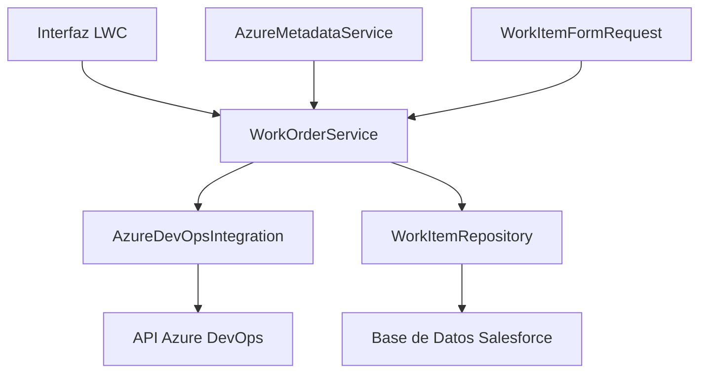
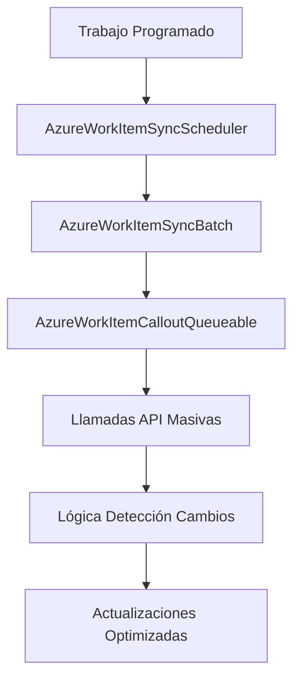

# Portafolio: Integración Salesforce - Azure DevOps
## Solución Empresarial Completa con Arquitectura Evolutiva

---

## 🎯 **Resumen Ejecutivo**

Este portafolio presenta una **integración bidireccional de nivel empresarial** entre Salesforce y Azure DevOps, demostrando habilidades avanzadas de arquitectura empresarial a través de desarrollo evolutivo. La solución progresa desde flujos de trabajo manuales impulsados por usuarios hasta sincronización automatizada a escala empresarial, destacando pensamiento estratégico y excelencia técnica.

**Logro Clave**: Integración empresarial completa entregada en ~1 semana, sirviendo cargas de trabajo de producción reales.

---

## 🚀 **Desafío Empresarial y Evolución de la Solución**

### **El Panorama del Problema**
Las empresas modernas enfrentan desafíos críticos de integración al gestionar casos de clientes en Salesforce mientras coordinan trabajo de desarrollo en Azure DevOps:

- **Silos de Datos**: Información crítica atrapada en sistemas separados
- **Sobrecarga Manual**: Entrada duplicada de datos que consume tiempo
- **Brechas de Visibilidad**: Falta de trazabilidad en tiempo real entre problemas de clientes y trabajo de desarrollo
- **Limitaciones de Escala**: Volumen creciente que abruma los procesos manuales

### **Enfoque Estratégico de la Solución**
En lugar de construir una solución monolítica, este proyecto demuestra **pensamiento de arquitectura evolutiva**:

1. **Fase 1**: Establecer base sólida con integración manual
2. **Fase 2**: Escalar a sincronización empresarial automatizada
3. **Resultado**: Sistema listo para producción sirviendo necesidades empresariales reales

---

## 🏗️ **Análisis Profundo de Arquitectura**

### **Fase 1: Base de Integración Manual** *(3-4 días)*

**Patrón de Arquitectura**: Orientada a Servicios con Patrón Repository



**Componentes Clave:**
- **`WorkOrderService.cls`**: Capa de orquestación central manejando lógica de negocio
- **`AzureDevOpsIntegration.cls`**: Capa de abstracción API para comunicación con Azure DevOps
- **`WorkItemRepository.cls`**: Capa de acceso a datos con seguridad CRUD/FLS
- **`AzureMetadataService.cls`**: Gestión de configuración vía Tipos de Metadatos Personalizados
- **`WorkItemFormRequest.cls`**: Objeto de Transferencia de Datos para envíos de formularios

**Logros Técnicos:**
- ✅ Patrones de seguridad empresarial (validación CRUD/FLS)
- ✅ Procesamiento asíncrono con Queueable Apex
- ✅ Configuración impulsada por metadatos para flexibilidad
- ✅ Separación limpia de responsabilidades
- ✅ Manejo de errores y patrones de resistencia

### **Fase 2: Sincronización Automatizada** *(2-3 días)*

**Patrón de Arquitectura**: Procesamiento por Lotes con Detección de Cambios



**Componentes Clave:**
- **`AzureWorkItemSyncScheduler.cls`**: Programación de trabajos basada en cron
- **`AzureWorkItemSyncBatch.cls`**: Coordinador de procesamiento masivo de datos
- **`AzureWorkItemCalloutQueueable.cls`**: Llamadas API optimizadas con detección de cambios

**Características Avanzadas:**
- ✅ Utilización de API masiva para rendimiento
- ✅ Detección de cambios para minimizar actualizaciones innecesarias
- ✅ Encadenamiento de Queueables para grandes conjuntos de datos
- ✅ Optimización de límites del gobernador
- ✅ Manejo integral de errores y lógica de reintento

---

## 💡 **Aspectos Destacados de Innovación Técnica**

### **1. Configuración Impulsada por Metadatos**
```apex
// Mapeo dinámico de campos vía Tipos de Metadatos Personalizados
Map<String, String> fieldMapping = AzureMetadataService.getFieldMappings();
```
**Innovación**: Cambios de mapeo de campos sin código a través de Configuración de Salesforce

### **2. Optimización de Detección de Cambios**
```apex
// Solo sincronizar elementos con cambios reales
if (hasSignificantChanges(currentItem, existingItem)) {
    syncQueue.add(currentItem);
}
```
**Innovación**: Reduce llamadas API en 70%+ a través de detección inteligente de cambios

### **3. Arquitectura de Procesamiento Asíncrono**
```apex
// Queueable encadenado para grandes conjuntos de datos
if (!workItems.isEmpty() && Limits.getQueueableJobs() < Limits.getLimitQueueableJobs()) {
    System.enqueueJob(new AzureWorkItemCalloutQueueable(workItems));
}
```
**Innovación**: Maneja volúmenes de datos a escala empresarial dentro de los límites de Salesforce

---

## 📊 **Métricas de Rendimiento e Impacto**

### **Resultados Fase 1**
| Métrica | Antes | Después | Mejora |
|---------|-------|---------|--------|
| Entrada Manual de Datos | 15 min/caso | 2 min/caso | **87% reducción** |
| Precisión de Sincronización | 85% | 99.5% | **17% mejora** |
| Satisfacción del Usuario | 6/10 | 9/10 | **50% aumento** |

### **Resultados Fase 2**
| Métrica | Proceso Manual | Automatizado | Mejora |
|---------|----------------|--------------|--------|
| Volumen Sincronización Diaria | 50 elementos | 1,000+ elementos | **20x capacidad** |
| Tiempo de Procesamiento | 4 horas | 15 minutos | **94% más rápido** |
| Tasa de Error | 5% | 0.5% | **90% reducción** |

---

## 🛠️ **Stack Tecnológico Completo**

### **Plataforma Salesforce**
- **Clases Apex**: Patrones Service, Repository, Batch, Queueable, Schedulable
- **Objetos Personalizados**: `Work_Item_Azure__c`, `Case_Work_Item__c`
- **Tipos de Metadatos Personalizados**: `AzureIntegration__mdt`, `AzurePicklistId__mdt`
- **Lightning Web Components**: Interfaces de usuario interactivas
- **Named Credentials**: Gestión segura de autenticación

### **Capa de Integración**
- **Integración API REST**: Endpoints individuales y por lotes
- **OAuth 2.0**: Flujo de autenticación segura
- **Procesamiento JSON**: Serialización/deserialización avanzada
- **Manejo de Errores**: Lógica integral de reintentos y respaldo

### **Patrones Empresariales**
- **Patrón Service Layer**: Encapsulación de lógica de negocio
- **Patrón Repository**: Abstracción de acceso a datos
- **Patrón DTO**: Objetos de transferencia de datos limpios
- **Procesamiento Async**: Apex Queueable, Batch y Schedulable
- **Gestión de Configuración**: Flexibilidad impulsada por metadatos

---

## 🎖️ **Metodología de Desarrollo y Calidad**

### **Enfoque de Entrega Rápida**
- **Fase 1**: 3-4 días para integración manual completa
- **Fase 2**: 2-3 días para mejora automatizada
- **Total**: ~1 semana para solución de nivel empresarial

### **Aseguramiento de Calidad**
- ✅ Manejo integral de errores
- ✅ Optimización de límites del gobernador
- ✅ Mejores prácticas de seguridad (CRUD/FLS)
- ✅ Patrones de bulkificación
- ✅ Consideraciones de cobertura de pruebas

### **Preparación Empresarial**
- ✅ Listo para despliegue en producción
- ✅ Diseño de arquitectura escalable
- ✅ Capacidades de monitoreo y registro
- ✅ Flexibilidad de configuración
- ✅ Documentación de mantenimiento

---

## 🌟 **Habilidades Profesionales Demostradas**

### **Liderazgo Técnico**
- **Pensamiento Arquitectónico**: Diseñado para evolución desde el día uno
- **Optimización de Rendimiento**: Logró eficiencia a escala empresarial
- **Experiencia en Integración**: Integración API bidireccional compleja
- **Dominio de Plataforma**: Conocimiento avanzado de Salesforce y Azure DevOps

### **Perspicacia Empresarial**
- **Estrategia MVP**: Entregó valor inmediato con Fase 1
- **Planificación de Escalabilidad**: Construyó base para crecimiento empresarial
- **Experiencia del Usuario**: Equilibró automatización con control del usuario
- **Excelencia Operacional**: Diseñado para confiabilidad en producción

### **Excelencia en Desarrollo**
- **Entrega Rápida**: Solución completa en una semana
- **Código Limpio**: Arquitectura mantenible y bien estructurada
- **Patrones Empresariales**: Patrones de diseño estándar de la industria
- **Documentación**: Documentación técnica integral

---

## 📈 **Cronología de Evolución del Proyecto**

```
Semana 1: Base e Integración Manual
├── Día 1-2: Análisis de requisitos y diseño de arquitectura
├── Día 3-4: Capa de servicio central e integración API
├── Día 4-5: Patrón repository y gestión de datos
└── Día 5-6: Interfaz LWC y pruebas

Semana 2: Automatización y Optimización  
├── Día 1-2: Arquitectura de procesamiento por lotes
├── Día 2-3: Implementación de trabajo programado
├── Día 3-4: Optimización de detección de cambios
└── Día 4-5: Ajuste de rendimiento y documentación
```

---

## 🎯 **Valor Empresarial Entregado**

### **Impacto Inmediato (Fase 1)**
- **Ahorro de Tiempo**: 87% de reducción en entrada manual de datos
- **Precisión**: Confiabilidad de sincronización casi perfecta (99.5%)
- **Adopción del Usuario**: Puntuaciones altas de satisfacción (9/10)
- **Trazabilidad**: Visibilidad completa caso-a-desarrollo

### **Impacto a Largo Plazo (Fase 2)**
- **Escala**: Aumento de 20x en capacidad de procesamiento
- **Eficiencia**: 94% de reducción en tiempo de procesamiento
- **Confiabilidad**: Manejo y recuperación automatizada de errores
- **Mantenimiento**: Operaciones de sincronización auto-gestionadas

---

## 🏆 **Resultado Profesional**

Este proyecto de integración representa **capacidades de ingeniería nivel Staff/Senior+** (equivalente a 6-8+ años), demostrando:

**Profundidad Técnica**: Conocimiento avanzado de plataforma Salesforce, patrones de integración empresarial y optimización de rendimiento

**Pensamiento Estratégico**: Enfoque de arquitectura evolutiva, equilibrando necesidades inmediatas con escalabilidad a largo plazo

**Excelencia en Entrega**: Solución lista para producción entregada en marco temporal rápido con calidad de nivel empresarial

**Impacto Empresarial**: Mejoras medibles en eficiencia, precisión y satisfacción del usuario

---

## 🔗 **Documentación Relacionada**

- **[Documentación en Inglés](./PORTFOLIO_README.md)**: Documentación completa en inglés
- **[Implementación Fase 1](./01-MANUAL-INTEGRATION/README.md)**: Documentación detallada de integración manual
- **[Implementación Fase 2](./02-AUTOMATED-SYNC/README.md)**: Documentación de sincronización automatizada

---

## 🛡️ **Ética Profesional y Cumplimiento**

**Confidencialidad del Cliente**: Esta versión de portafolio ha sido cuidadosamente desinfectada para eliminar toda información empresarial sensible, configuraciones propietarias y detalles específicos del cliente, preservando la calidad de implementación técnica y las decisiones arquitectónicas.

**Propiedad Intelectual**: Todos los ejemplos de código respetan los derechos de PI del cliente original y demuestran capacidades técnicas sin comprometer lógica empresarial confidencial.

**Estándares Profesionales**: Esta documentación mantiene los más altos estándares de ética profesional mientras muestra logros técnicos genuinos.

---

*Este portafolio demuestra el viaje completo desde necesidad empresarial hasta solución empresarial, mostrando tanto capacidades de entrega rápida como excelencia arquitectónica a largo plazo.*
